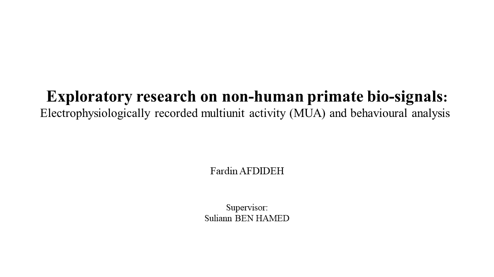
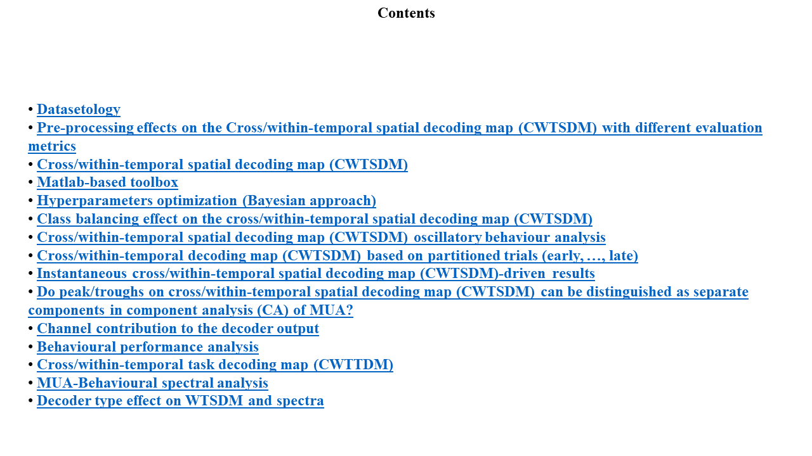
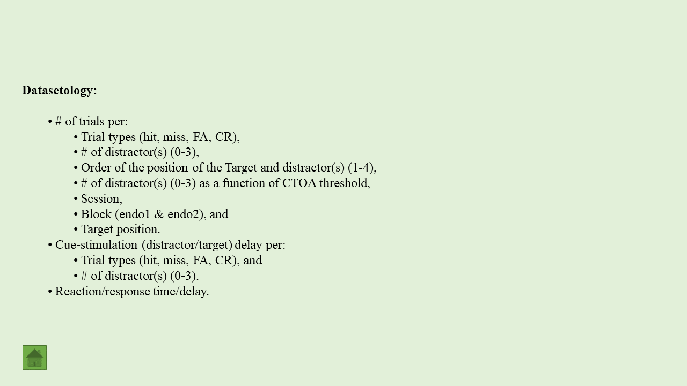

# Invasive cognitive brain-computer interfaces to enhance and restore attention
The use of classification procedures to decode brain activity associated to specific aspects of human behaviour is the basis of brain-computer interface (BCI). Classically applied in motor-related activities, an increasing amount of evidence suggests the feasibility to develop BCI technologies relying on higher-order cognitive functions such as attention. In this context, prior studies have succeed in decoding the attentional spotlight (AS) with a high temporal resolution, allowing to understand the dynamics of the attentional system during its active engagement, but also to envision the development of neurofeedback (NF) approaches to increase attentional resources. In this context, we trained two macaques monkeys to perform a 100% validity cued endogenous attentional task while multiunit activity (MUA) was intra-cranially recorded from both Frontal Eye Fields. During the task performance, position of the AS was decoded in real-time and, when the AS was in the cued quadrant, a feedback was provided in form of a sensory information (sound) and reward (water intake). 
We found that attention position was encoded differently after the NF. Specifically, we observed that after NF the spatial prefrontal population code for attention changed dynamically during the cue-to-target interval, showing an alternation between a new code and the pre-NF code. We computed the frequency of this code alternation and we found that both codes systematically alternate within the theta (4-7Hz) band, which is associated with the learning of new contingencies. Interestingly, the phase of this oscillation accounted for significant variations in behavioural performance, suggesting that these NF-induced oscillations impact both function and behavior. 
These results demonstrate for the first time that (i) the application of attention-related NF modulates how the prefrontal cortex encodes information and (ii) these changes are a functional signature that accounts for behaviour. Altogether, our data envision the feasibility of the NF-based interventions in the attention domain with potential applications in healthy population or as a treatment for attention disorders.

 

# How to cite
* F. Afdideh, J. Amengual, C. Gaillard, E. Astrand, S. Ben Hamed, “Covert spatial attention-based neurofeedback changes the neuronal population code of the frontal eye fields in an oscillatory manner: A non-human primate study,” FENS (S04-094), 9-13 Jul., 2022.
* F. Afdideh, J. Amengual, C. Gaillard, E. Astrand, S. Ben Hamed, “Learning an attention-based neurofeedback impacts function and behaviour within theta band,” NeuroFrance International virtual meeting (P1.68), 19-21 May, 2021.
