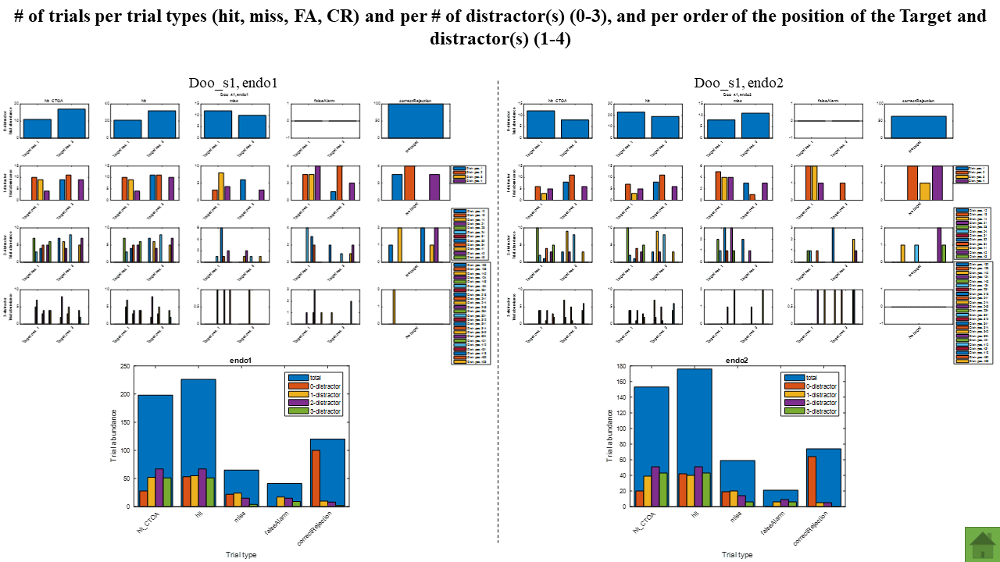
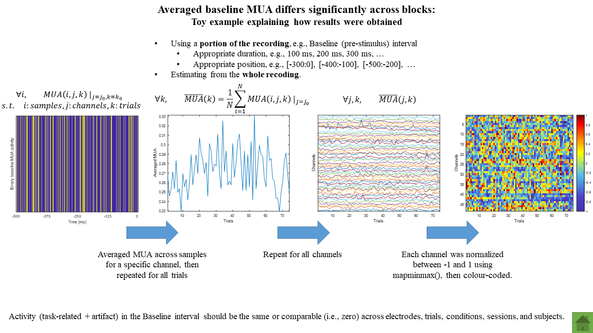
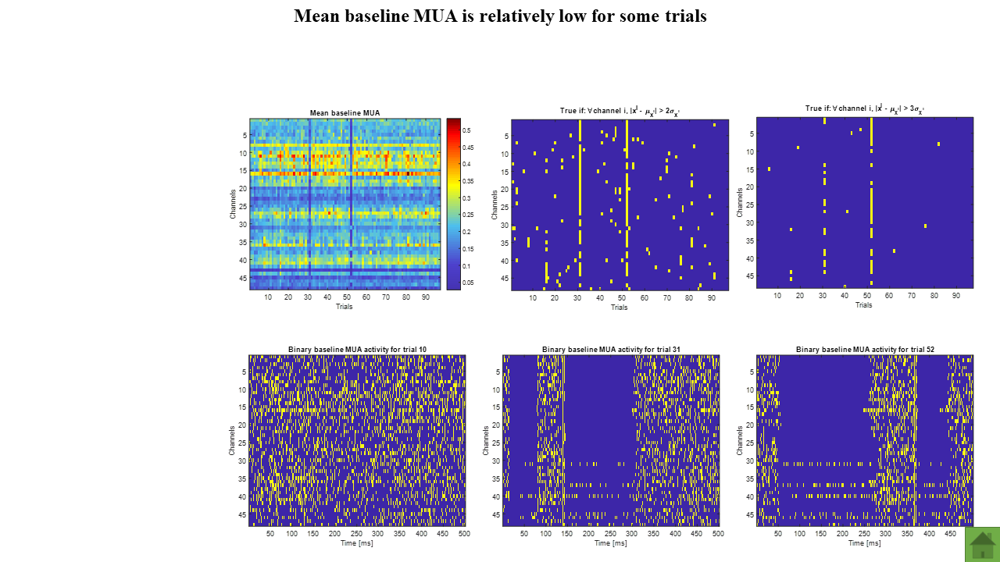

# Invasive cognitive brain-computer interfaces to enhance and restore attention

 

# How to cite
* F. Afdideh, J. Amengual, C. Gaillard, E. Astrand, S. Ben Hamed, “Covert spatial attention-based neurofeedback changes the neuronal population code of the frontal eye fields in an oscillatory manner: A non-human primate study,” FENS (S04-094), 9-13 Jul., 2022.
* F. Afdideh, J. Amengual, C. Gaillard, E. Astrand, S. Ben Hamed, “Learning an attention-based neurofeedback impacts function and behaviour within theta band,” NeuroFrance International virtual meeting (P1.68), 19-21 May, 2021.
